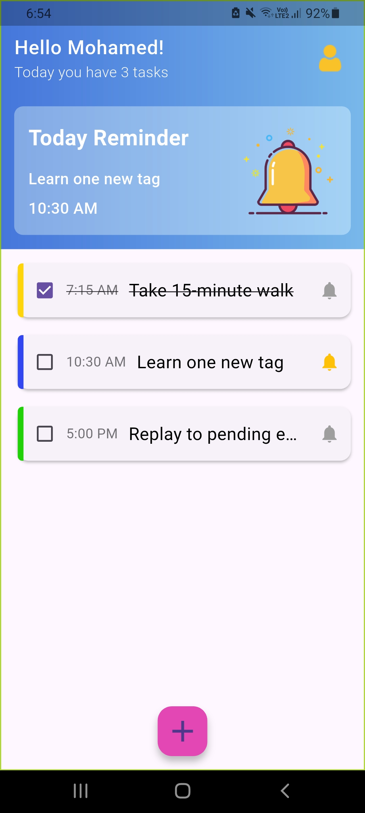
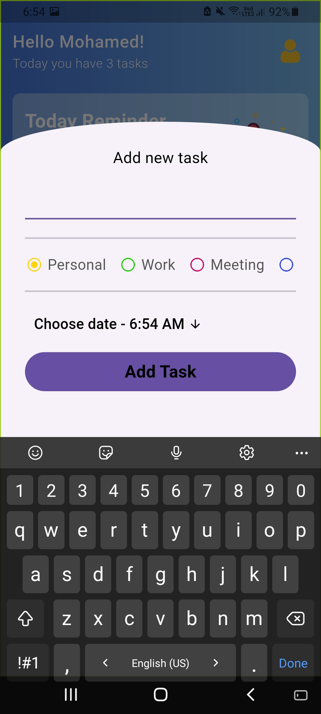
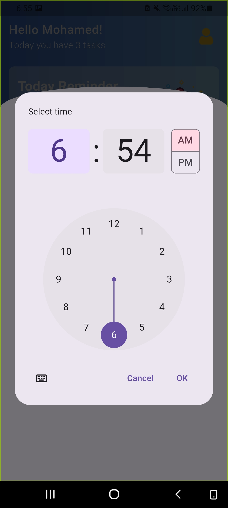

# Todoy - Daily Tasks App

A simple daily task app built with Flutter to help manage everyday work quickly with a clean and friendly interface.

## About The Project

Todoy is a lightweight To-Do app that helps you:

- Add a new task with title, time, and category.
- Track daily tasks in a list sorted by time.
- Select a task as a daily reminder shown in the Today Reminder card.
- Mark tasks as completed or remove them with swipe actions.

The app uses local storage with SQLite, so task data remains saved on the device.

## Features

- Add task with:
	- Title
	- Time picker
	- Category (`Personal`, `Work`, `Meeting`, `Study`)
- Auto sorting tasks by time.
- Mark task as done/undone with checkbox.
- Swipe left/right to delete task.
- Set one task as "Today Reminder" from bell icon.
- Empty state UI when no tasks exist.
- Local persistence with `sqflite`.

## Tech Stack

- Flutter
- Dart
- GetX (state management)
- sqflite (local database)

## Screenshots

<p align="center">
	
	
	
</p>

## Project Structure

```text
lib/
	main.dart
	constants.dart
	models/
		task.dart
	controllers/
		tasks_controller.dart
	views/
		screens/
			home_screen.dart
			add_task_screen.dart
		widgets/
			top_bar.dart
			today_reminder.dart
			task_view.dart
			category_view.dart
			choose_date.dart
			custom_text.dart
			no_tasks_yet.dart
```

## Getting Started

### Prerequisites

- Flutter SDK (Dart SDK included)
- Android Studio or VS Code
- Emulator or physical device

> Current Dart constraint in this project: `>=3.0.0 <4.0.0`

### Installation & Run

```bash
flutter pub get
flutter run
```

### Build APK (Release)

```bash
flutter build apk --release
```

---

## 📄 License

This project is licensed under the MIT License

---

## 👨‍💻 Author

**Mohamed Elsawy**

- 📧 [moelesawy19@gmail.com](mailto:moelesawy19@gmail.com)
- 📱 +201091460933
